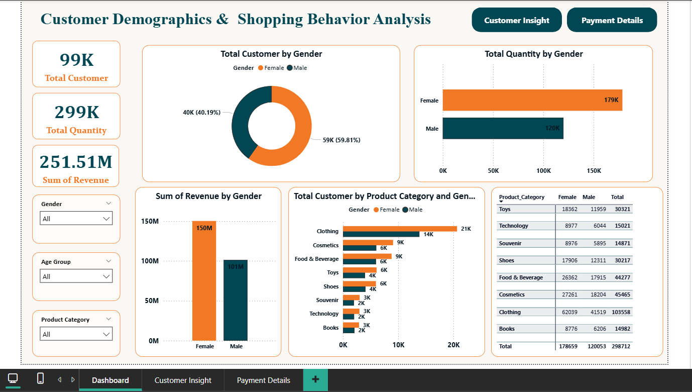
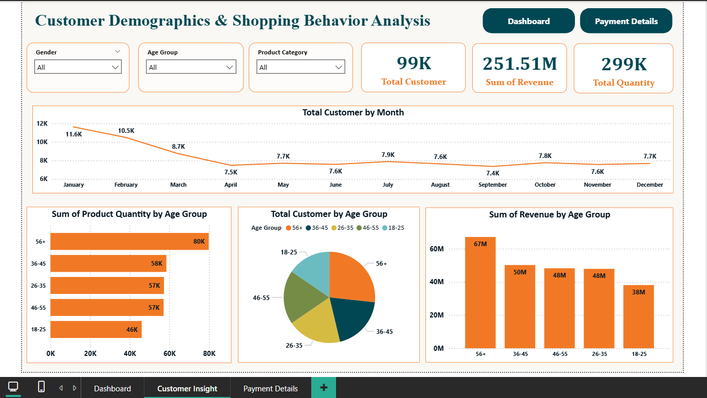
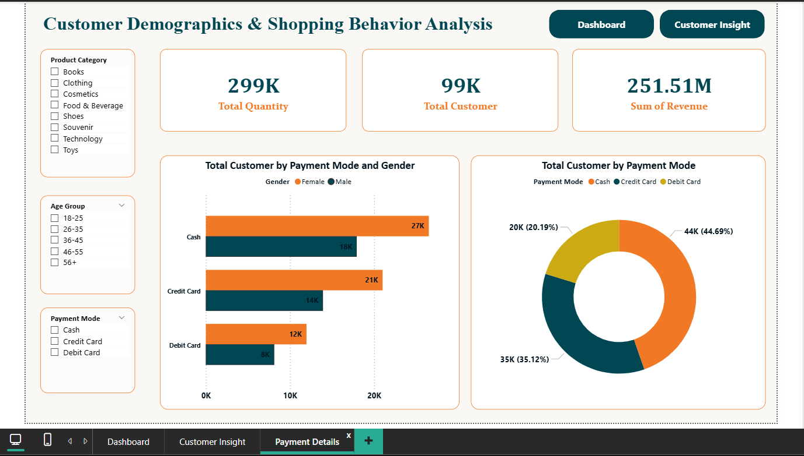

# 📊 Customer Demographic and Shopping Behavior Analysis

## 👀 Dashboard Preview

## 🎯Project Objective
This project analyzes customer demographics and shopping behaviour to uncover patterns, trends, and insights that can help businesses improve their marketing strategies, sales performance, and customer engagement.  

The dashboard provides a comprehensive view of customer age groups, gender distribution, purchase frequency, preferred product categories

##  🧩 Tasks / Problem Statements
1.	How is the shopping distribution according to gender? 
2.	Which gender did we sell more products to? 
3.	Which gender generated more revenue? 
4.	Distribution of purchase categories relative to other columns? 
5.	How is the shopping distribution according to age? 
6.	Which age cat did we sell more products to? 
7.	Which age cat generated more revenue? 
8.	Distribution of purchase categories relative to other columns? 
9.	Does the payment method have a relation with other columns? 
10.	How is the distribution of the payment method? 
11.	Visualize the data using Tableau /PowerBI and derive insights and give your inputs/suggestions to the company. 

## Data Source
This dataset contains shopping information from 10 different shopping 
malls between 2021 and 2023
- Dataset: Customer transaction records and demographic data (CSV format)  
- Columns include: invoice_no, customer_id, gender, age, category, quantity, price, payment_method, invoice_date, shopping_mall

## Tools and Technologies Used
**Excel / CSV** – Raw data source  
**SQL** - Analyze the queries 
**Power BI Desktop** – Dashboard creation and data visualization  
**Power Query** – Data cleaning and transformation  
**DAX** – Calculated metrics and measures 

## Data Cleaning & Transformation
- Removed duplicate records
- Standardized gender and category values
- Created age groups (18–25, 26–35, 36–45, 46–55, 56+)

## Measures
- Total Customer
- Total Quantity
- Sum of Revenue

## 📸 Dashboard Snapshot
### 🟦 **1. Main Dashboard (1-Page Overview)**
This page provides a complete one-page summary of the overall customer and sales performance.  
It includes key KPIs, demographic overview, spending trends, and category-wise analysis. 

### 🟩 **2. Customer Insights**
This page focuses on understanding customer demographics and behaviour patterns. 

### 🟧 **3. Payment Details**
This page shows payment preferences and transaction patterns. 

## Key Insights
This analysis provides insights on customer demographics, revenue contribution, popular product categories, and payment preferences.

**✅ Overall Summary:**

Total Customers: 99K+ 👥 

Total Quantity Sold: 299K+ 🛒 

Total Revenue: 251.51M 💰 

**✅ Gender Insights:**

Female customers account for ~60% of the total customer base 👩

Female customers contribute the highest share of revenue, surpassing male customers 💵

**✅ Age Group Insights:**

56+ age group generates the highest revenue (~67M) 🏆

36–45 age group shows steady and consistent purchasing behavior ✅

18–25 age group contributes the lowest share of revenue 📉

**✅ Product Category Insights:**

Clothing is the most purchased category with 100K+ customers and the highest revenue contribution 👗

Cosmetics and Food & Beverage show strong and consistent demand 💄🍔

Technology category has comparatively lower customer participation 💻

**✅ Payment Mode Insights:**

Cash is the most used payment method (~45% of transactions) 💵

Credit Cards are the second most used (~35%) 💳

Debit Cards contribute ~20% of transactions 🏦

## Key Features
- Interactive visuals to analyze customer demographics (age, gender, location)  
- Insights into shopping behaviour such as purchase frequency, average spend, and product preferences  
- Filters by region, product category, and time period for granular analysis  
- Key metrics (KPI cards) for quick insights  
- Drill-through functionality for detailed customer-level analysis

## 📈 Outcome & Business Value
- Identified high-value customer segments
- Enabled better marketing targeting by age and gender
- Provided visibility into payment preferences
- Helped stakeholders make data-driven decisions

## Author & Contact
Ashwini Pawar 
Data Analyst

**Email**: [2005ashwinipawar@gmail.com](mailto:2005ashwinipawar@gmail.com)</a> 
**Github**: [ashwinipawar25](https://github.com/ashwinipawar25)

